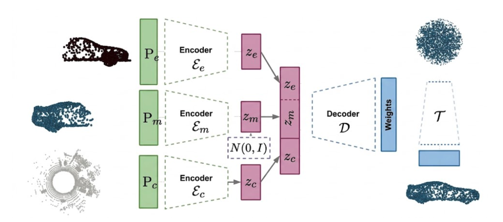
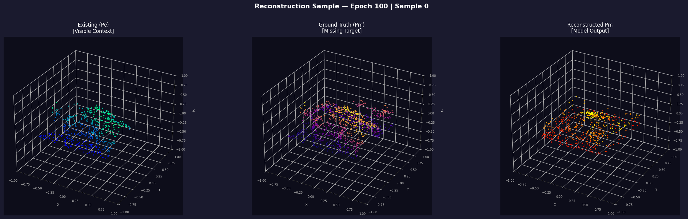
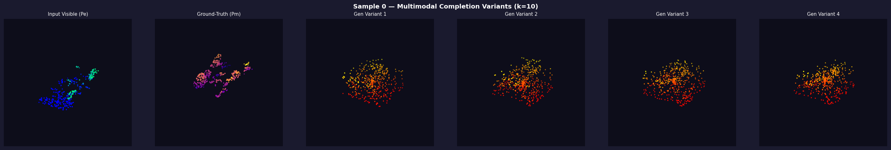
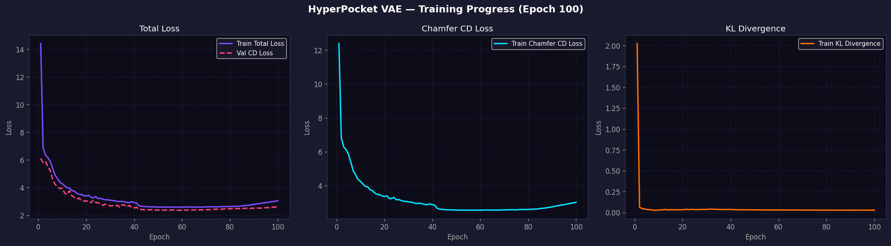

# Autoencoder-Based Reconstruction of Incomplete Structures in Urban 3D Point Clouds

**Master's Thesis Research**  
Brandenburg University of Technology Cottbus-Senftenberg (BTU)  
Department of Mathematics and Computer Science  
Chair of Applied Mathematics and Computer Vision  

* **Author:** Syed Rayyan Adil  
* **Supervisors:** Martin Schorradt, Prof. Dr. Michael Breuß  

---

## 1. Introduction

Point cloud completion is a foundational task in 3D computer vision and digital photogrammetry. While synthetic benchmarks such as ShapeNet facilitate rapid experimentation on canonical, isolated objects, real-world aerial LiDAR and UAV photogrammetric surveys introduce severe structural challenges:

* **Occlusion and Sensor Artifacts:** Scanning angle limitations, vegetation shadows, and variable flight paths produce extensive non-random data voids and partial structural captures.
* **Absence of Environmental Context:** Conventional deep completion networks treat target objects in isolation. In urban environments, however, architectural components (such as building footprints, roof lines, and facades) are strongly correlated with their immediate spatial neighborhood, including street layouts, adjacent structures, and terrain topography.

This work investigates a generative formulation based on Variational Autoencoders (VAEs) that directly conditions the completion of incomplete urban point cloud blocks on their surrounding geographic context. The proposed framework is trained and benchmarked on large-scale point clouds from the SensatUrban dataset.

---

## 2. Methodology

The proposed approach extends the implicit completion formulation of HyperPocket (Wu et al., 2022) to large-scale urban domains by incorporating a dedicated Context Encoder (E<sub>c</sub>).

<p align="center">
  
  <br>
  <em><b>Figure 1: Architectural Overview.</b> The framework processes three point sets: visible context (P<sub>e</sub>), target missing geometry (P<sub>m</sub>), and spatial neighborhood context (P<sub>c</sub>). Latent representations from deterministic and stochastic encoders are concatenated to condition the HyperNetwork, which synthesizes the weights for an implicit TargetNetwork decoder.</em>
</p>

### 2.1 Problem Formulation and Data Representation
Let an urban scene be partitioned into ground blocks of size 30 m × 30 m, subsampled to a fixed budget of N = 1,024 points per block:
* **P<sub>e</sub> ∈ ℝ<sup>N × 3</sup>:** Visible context partition obtained via synthetic 3D hyperplane partitioning through the block centroid.
* **P<sub>m</sub> ∈ ℝ<sup>N × 3</sup>:** Missing target geometry to be reconstructed.
* **P<sub>c</sub> ∈ ℝ<sup>N × 3</sup>:** Spatial neighborhood context composed of the K = 4 nearest physical neighbor blocks identified using a 2D k-d tree. Neighbors are translated by their relative spatial centroid offsets before concatenation and resampling:

$$
\mathbf{P}_{\text{aligned}} = \mathbf{P}_{\text{neighbor}} + \left(\mathbf{C}_{\text{neighbor}} - \mathbf{C}_{\text{target}}\right)
$$

All point coordinates are normalized to the unit sphere [-1, 1]³.

### 2.2 Multi-Encoder Generative Architecture
1. **Visible Encoder (E<sub>e</sub>):** A deterministic PointNet mapping visible context to latent code **z<sub>e</sub> ∈ ℝ¹²⁸**.
2. **Missing Target Encoder (E<sub>m</sub>):** A stochastic PointNet parameterizing a Gaussian distribution **q(z<sub>m</sub> | P<sub>m</sub>) = 𝒩(μ, Σ)**, yielding latent sample **z<sub>m</sub> ∈ ℝ¹²⁸** via the reparameterization trick.
3. **Context Encoder (E<sub>c</sub>):** A feature extraction module mapping spatial neighborhood point cloud P<sub>c</sub> to context vector **z<sub>c</sub> ∈ ℝ¹²⁸**.
4. **Conditioned Latent Representation:**

$$
\mathbf{z}_{\text{cond}} = [\mathbf{z}_m, \mathbf{z}_e, \mathbf{z}_c] \in \mathbb{R}^{384}
$$

### 2.3 Context Encoder Architectures Evaluated
To understand how spatial context is best encoded, three distinct neural network paradigms are investigated for E<sub>c</sub>:
* **PointNet:** A global pooling architecture applying multi-layer perceptrons independently to each point, followed by symmetric max-pooling.
* **Dynamic Graph CNN (DGCNN):** An edge-convolutional network constructing dynamic k-NN graphs in feature space to capture fine-grained architectural contours and topological continuity across block boundaries.
* **Latent Cross-Attention Transformer:** A Set Transformer utilizing Pooling by Multihead Attention (PMA), where a learnable query vector attends over input coordinates with linear computational complexity.

### 2.4 HyperNetwork and Implicit Decoding
Rather than predicting point coordinates through dense deconvolution or fixed-size fully connected layers, a **Context HyperNetwork** predicts the parameters of an implicit **TargetNetwork** MLP:
* **HyperNetwork:** Multi-layer perceptron (384 → 64 → 128 → 512 → 1024 → 2048) with linear heads outputting weights and biases.
* **TargetNetwork:** Coordinate-based implicit MLP (3 → 32 → 64 → 128 → 64 → 3) mapping random points sampled continuously from a unit sphere to the reconstructed 3D surface.

### 2.5 Optimization Objective
Training minimizes a combined loss function comprising Chamfer Distance (reconstruction fidelity) and Kullback-Leibler divergence (latent space regularization):

$$
\mathcal{L} = \lambda_{\text{CD}} \cdot \mathcal{L}_{\text{CD}}(\mathbf{P}_m, \hat{\mathbf{P}}_m) + \beta \cdot D_{\text{KL}}\left(q(\mathbf{z}_m \mid \mathbf{P}_m) \parallel \mathcal{N}(\mathbf{0}, \mathbf{I})\right)
$$

where default hyperparameters follow λ<sub>CD</sub> = 0.05 and β = 1.0. Training utilizes the Adam optimizer with initial learning rate 10⁻⁴ and StepLR decay (γ = 0.01 at epoch 41).

---

## 3. Quantitative Evaluation and Benchmarks

Quantitative evaluation is conducted on the official test partition of the SensatUrban dataset, comprising **1,077 unseen urban blocks**. Each model generates k = 10 stochastic completions per partial input to evaluate both reconstruction accuracy and generative distribution properties.

### 3.1 Evaluation Metrics
* **Reconstruction Chamfer Distance (Recon CD ↓):** Pairwise squared distance between generated and ground-truth coordinates (10³ scale).
* **Earth Mover's Distance (Recon EMD ↓):** Optimal transport distance computed via entropy-regularized Sinkhorn iterations.
* **Minimum Matching Distance (MMD CD ↓):** Fidelity of synthesized completions to the nearest valid test distribution samples.
* **Total Mutual Distance (TMD ↑):** Pairwise distance among the k generated variants per block, measuring multimodal sampling diversity.
* **Jensen-Shannon Divergence (JSD ↓):** Statistical divergence between coordinate occupancy distributions over a 28³ voxel grid.

---

### 3.2 Main Comparative Benchmark

| Paradigm | Architecture Details | Recon CD ↓ | Recon EMD ↓ | MMD (CD) ↓ | TMD ↑ | JSD ↓ | Best Epoch |
|:---|:---|:---:|:---:|:---:|:---:|:---:|:---:|
| **Baseline (No Context)** | Isolated HyperPocket (Wu et al., 2022) | 68.68 | 0.2004 | 38.58 | **62.41** | **0.1233** | 60 |
| **PointNet E<sub>c</sub>** | Context-Aware Baseline | 62.86 | **0.1989** | 40.34 | 53.65 | 0.1613 | 59 |
| **DGCNN E<sub>c</sub>** | Dynamic EdgeConv (k = 20, Dual Pooling) | 60.10 | 0.2036 | 39.52 | 52.85 | 0.1728 | 65 |
| **Cross-Attention E<sub>c</sub>** | Set Transformer PMA (d = 256, H = 4) | **57.80** | 0.2038 | **38.21** | 47.42 | 0.1829 | 62 |

---

### 3.3 Systematic Ablation Studies

The table below reports all 14 evaluated model configurations, detailing the influence of loss regularizations, graph neighborhood parameters, pooling operators, and transformer dimension scales.

| Family | Experiment Key | Configuration Details | Recon CD ↓ | Recon EMD ↓ | MMD (CD) ↓ | TMD ↑ | JSD ↓ | Best Epoch |
|:---|:---|:---|:---:|:---:|:---:|:---:|:---:|:---:|
| **Baseline Variants** | `baseline_default` | Isolated (λ = 0.05, β = 1.0) | 68.68 | 0.2004 | 38.58 | **62.41** | **0.1233** | 60 |
| | `exp2_reduced_beta` | Isolated (λ = 1.0, β = 0.001) | 67.64 | 0.2095 | 40.73 | 37.74 | 0.2061 | 60 |
| | `exp3_annealing` | Isolated (β-annealing 0 → 0.001) | 62.76 | 0.2424 | 38.64 | 36.81 | 0.3293 | 62 |
| **PointNet E<sub>c</sub> Loss Ablations** | `exp1_context_default` | PointNet E<sub>c</sub> (λ = 0.05, β = 1.0) | 62.86 | **0.1989** | 40.34 | 53.65 | 0.1613 | 59 |
| | `exp2_context_reduced_beta` | PointNet E<sub>c</sub> (λ = 1.0, β = 0.001) | 70.95 | 0.2313 | 40.84 | 39.95 | 0.3088 | 57 |
| | `exp3_context_annealing` | PointNet E<sub>c</sub> (β-annealing 0 → 0.001) | 79.84 | 0.2643 | 47.33 | 27.74 | 0.3961 | 53 |
| **DGCNN E<sub>c</sub> Graph Ablations** | `exp4_dgcnn_context` | EdgeConv (k = 20, Dual Max+Avg Pooling) | 60.10 | 0.2036 | 39.52 | 52.85 | 0.1728 | 65 |
| | `exp4a_dgcnn_k10` | Sparse Graph (k = 10) | 68.12 | 0.1994 | 41.02 | 51.78 | 0.1347 | 58 |
| | `exp4b_dgcnn_k40` | Dense Graph (k = 40) | 64.38 | 0.2052 | 38.74 | 51.08 | 0.1629 | 61 |
| | `exp4c_dgcnn_light` | Reduced Channels [32, 32, 64, 128] | 63.79 | 0.2128 | 38.40 | 48.40 | 0.1793 | 67 |
| | `exp4d_dgcnn_max_only` | Max-Only Pooling (1024D vs. 2048D) | 64.06 | 0.2012 | 38.65 | 50.00 | 0.1577 | 54 |
| **Cross-Attention E<sub>c</sub> Ablations**| `exp5_ca_context` | Set Transformer (d = 128, H = 4) | 63.48 | 0.2058 | 39.58 | 54.53 | 0.1696 | 57 |
| | `exp5a_ca_dim64` | Reduced Latent Dimension (d = 64, H = 4) | 60.73 | 0.2021 | **37.37** | 50.65 | 0.1687 | 61 |
| | `exp5b_ca_dim256` | Expanded Latent Dimension (d = 256, H = 4) | **57.80** | 0.2038 | 38.21 | 47.42 | 0.1829 | 62 |
| | `exp5c_ca_heads2` | Multi-Head Configuration (d = 128, H = 2) | 61.68 | 0.2023 | 38.65 | 49.23 | 0.1738 | 57 |
| | `exp5d_ca_heads8` | Multi-Head Configuration (d = 128, H = 8) | 62.98 | 0.2032 | 42.13 | 55.62 | 0.1797 | 59 |

---

### 3.4 Findings and Discussion
1. **Impact of Spatial Conditioning:** Incorporating spatial neighborhood context consistently reduces reconstruction error across all model types. The Cross-Attention encoder with d = 256 achieves the lowest Chamfer Distance (**57.80**), reflecting a **15.8% reduction in error** compared to the unconditioned baseline (**68.68**).
2. **Graph Scale in DGCNN:** Graph neighborhood size is critical. A neighborhood of k = 20 yields optimal performance. Constraining connectivity to k = 10 limits topological message passing (CD increases to 68.12), whereas over-aggregating with k = 40 leads to oversmoothed representations across discrete structural boundaries (CD 64.38).
3. **Dual Global Pooling:** Combining max-pooling and average-pooling in DGCNN provides dual sensitivity to sharp structural edges (max) and broad volume distribution (avg), yielding a 4.0-point CD advantage over max-only pooling.
4. **Diversity Trade-Off:** The unconditioned baseline exhibits higher sample diversity (TMD = 62.41) because its completions are unconstrained by local geography. Conditioning on adjacent tiles regularizes generative hallucination to remain structurally compatible with neighboring geometry, yielding focused diversity (TMD ∈ [47, 55]).

---

## 4. Qualitative Results

### 4.1 Surface Reconstruction Fidelity
<p align="center">
  
  <br>
  <em><b>Figure 2: Surface Reconstruction Comparison.</b> From left to right: Partial input point cloud (P<sub>e</sub>), ground-truth target (P<sub>m</sub>), and network completion (P̂<sub>m</sub>).</em>
</p>

### 4.2 Multimodal Generative Sampling
<p align="center">
  
  <br>
  <em><b>Figure 3: Stochastic Completion Variants.</b> Given an identical visible input (P<sub>e</sub>), distinct random latent vectors sampled from the prior synthesize structurally distinct, plausible completions of missing urban geometry.</em>
</p>

### 4.3 Training Convergence
<p align="center">
  
  <br>
  <em><b>Figure 4: Loss Curves.</b> Training and validation losses over 100 epochs with StepLR scheduling at epoch 41 and validation plateau monitoring.</em>
</p>

---

## 5. Dataset and Preprocessing Pipeline

The experimental data is derived from the **SensatUrban** dataset (Hu et al., 2021), comprising photogrammetric and aerial LiDAR scans from the cities of Birmingham and Cambridge, UK (~2.8 billion raw points).

* **Subsampling:** Raw `.ply` point clouds are voxel-grid subsampled with a grid resolution of δ = 0.20 m.
* **Spatial Tiling:** The XY plane is partitioned into non-overlapping 30 m × 30 m blocks. Blocks containing fewer than 512 points are excluded.
* **Block Resampling:** Valid blocks are resampled to exactly N = 1,024 points via uniform sampling.
* **Normalization:** Centroids are shifted to the origin and scaled to [-1, 1]³ via maximum Euclidean radius division.
* **Dataset Splits:** Following the standard benchmark split, **4,193 blocks** (37 scenes) are assigned to training and **1,077 blocks** (6 scenes) are allocated for validation and evaluation.

---

## 6. Codebase Structure and Usage

### 6.1 Directory Overview
```
├── configs/                            # Experiment configurations
│   ├── base_config.py                  # Global hyperparameters and defaults
│   ├── base_hyperpocket_architecture.py# Baseline configurations
│   └── context_hyperpocket_architecture.py # Context configurations (PointNet, DGCNN, CA)
├── datasets/                           # Data loading and preprocessing
│   ├── preprocess.py                   # Voxel downsampling and 30m block partitioning
│   ├── build_neighbor_index.py         # 2D k-d tree neighbor index generation (K=4)
│   ├── sensat_dataset.py               # Baseline dataset implementation
│   ├── context_sensat_dataset.py       # Context-aware dataset implementation
│   ├── neighbor_map.json               # Spatial neighbor lookup index
│   └── tile_centroids.json             # Absolute metric block centroids
├── models/                             # PyTorch model definitions
│   ├── base_hyperpocket.py             # PointNet encoders and implicit TargetNetwork
│   ├── context_hyperpocket.py          # Context-Aware VAE and Context HyperNetwork
│   ├── dgcnn_context_encoder.py        # Dynamic Graph CNN (EdgeConv) Ec implementation
│   └── cross_attention_encoder.py      # Latent Cross-Attention (Set Transformer) Ec
├── utils/                              # Quantitative evaluation and utilities
│   ├── sensat_metrics.py               # Evaluation metrics (CD, EMD, MMD, TMD, JSD)
│   └── visualize.py                    # Plotting utilities
├── assets/                             # Documentation figures
├── train.py                            # Training pipeline with AMP and early stopping
├── evaluate.py                         # Evaluation pipeline (k=10 completions)
└── requirements.txt                    # Python environment specifications
```

### 6.2 Environment Setup
```bash
git clone https://github.com/syedrayyanadil/GenerativeVaeReconstruction3DPointcloud.git
cd GenerativeVaeReconstruction3DPointcloud
pip install -r requirements.txt
```

### 6.3 Training
```bash
# Baseline HyperPocket (No Context)
python train.py --config base_hyperpocket.default

# Context-Aware DGCNN (k=20)
python train.py --config context_hyperpocket.exp4_dgcnn_context

# Context-Aware Cross-Attention (d=256)
python train.py --config context_hyperpocket.exp5b_ca_dim256
```

### 6.4 Evaluation
```bash
python evaluate.py --config context_hyperpocket.exp4_dgcnn_context
```

---

## 7. References

1. **HyperPocket:** Wu, Z., et al. *"HyperPocket: Generative Point Cloud Completion."* IEEE Transactions on Visualization and Computer Graphics (TVCG), 2022.
2. **SensatUrban:** Hu, Q., et al. *"Towards Semantic Segmentation of Urban-Scale 3D Point Clouds: A Dataset, Benchmarks and Challenges."* International Journal of Computer Vision (IJCV), 2021.
3. **DGCNN:** Wang, Y., et al. *"Dynamic Graph CNN for Learning on Point Clouds."* ACM Transactions on Graphics (TOG), 2019.
4. **Set Transformer:** Lee, J., et al. *"Set Transformer: A Framework for Attention-based Permutation-Invariant Neural Networks."* International Conference on Machine Learning (ICML), 2019.
